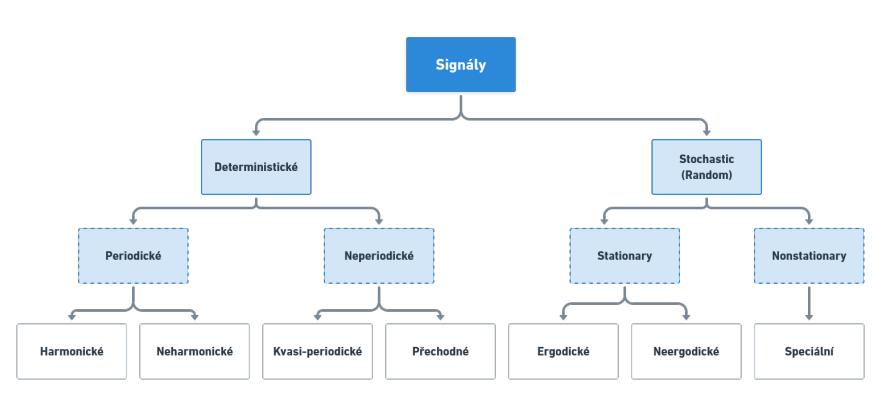

[Zpět na uvodni stranu](../README.md)  

**sample and hold obvod** - obvod který slouží k převodu z analogového signálu na digitální - má dvě částisamotné vzorkování a pak se tento signál drží v hold obvodu pro další zpracování a pouští se až při dalším vzorkování

**Aliasing** je jev v digitální zpracování signálů, který se vyskytuje, když je analogový signál vzorkován s příliš nízkou frekvencí, což vede k nesprávné reprezentaci signálu - vhodné vzorkování je 2x větší než je frekvence

**Co to je signál** 
- prostředek přenosu informace
- reálný signál: elektrické napětí
- abstraktní signál: matematický model

**Geneze - vznik** jak vzniká signál například v lidském těle

**předzpracování biologických signálů** jedná o proces kdy se například odfiltrová rušení nebo nějaké signály které způsobovaly vnější objekty

    Deterministické - lze přesně popsat matematickým výrazem nebo funkcí

        Periodický - opakuje se s určitou frekvencí

            Harmonický - obsahuje složky frekvencí, které jsou celočíselnými násobky základní frekvence

            Neharmonický - neobsahuje složky frekvencí, které jsou celočíselnými násobky základní frekvence

        Nepeoridický - neopakuje se s určitou frekvencí

            Kvasiperiodický - který vykazuje nějakou formu pravidelnosti nebo periodičnosti, ale není přesně periodický

            Přechodoný - vyskytuje se pouze v omezeném časovém období 

    Stochastický - nelze přesně popsat matematickým výrazem nebo funkcí

        Stacionární - má statistické vlstnosti, které zůstavají konstanstantí v čase

            Ergodický - lze u něj odhadnou statisctické vlstnosti z jediné realizace signálu

            Neergodický - nelze u něj odhadnou statisctické vlstnosti z jediné realizace signálu

        Nestacionární - statistické vlastnosti, které se čase mění

**Spojitý signál** je takový signál kde čas `t` je spojitá proměnná

**Diskrétní signál** čas `t` je definován v diskrétní časových okamžicích

**Konzistentní** s roustoucím počtem pozorování se blíží teoretické hodnotě

**Nestranný** střední hodnota kolísá symetricky kolem skutečné

**Vydatný** minimální rozptyl - snižuje se s počtem pozorování

**Robustní** odlehléí hodnoty nemají významný vliv na skutečnou hodnotu odhadu

| Druh projevu | ZPůsov snímán | Diagnostická metoda |  
|:---:         |:---:          | :---:               | 
|Mechanické - výkon|mechanoelektrické měřiče| spirometrie|
|tepelné|teploměry|kontaktní teploměry|
|elektrické|elektrory|elektromyografie|
|magnetické|MEG|magnetokardiografie|
|faktory vnitřního projevu|elektrody|monitorování vnitřního prostředí|

|Modulovaná veličina|Způsob modulace|Snímač|Diagnostická metoda|  
| :---:| :---:| :---:|:---:|
|jaderné záření|rozložení aktivity zářiče|scintilační detektroy|pohybová scintiagrafie|
|RTG|útlum|luminiscenční stínítko|skiagrafie|
|viditelné záření|odraz|fotokamera|endoskopie|
|ultrazvuk|odraz|piezoelktrický měnič|ultrasonografie|
|elektrický proud|elektrická vodivost|elektrody|reopletysmografie|
|elektromagnetické pole|rezonanční, elektromagnetický impuls|měřící cívky|magnetická rezonanční tomografie(MRI)|

    

[Zpět na uvodni stranu](../README.md)
