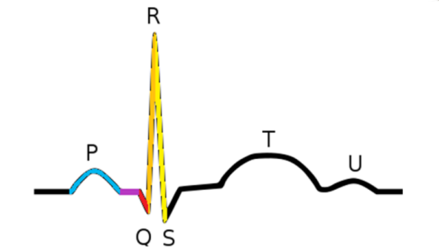

[Zpět na uvodni stranu](../README.md) 

# EKG - Elektrokardiograf
EKG je strandardní neivazivní metodou funkčního vyčetření elektrické aktivity myokardu  

Narozdíl od CNS vykazuje práce srdce daleko větší synchronicitu a periodicitu

Signál se šíří z myokardu poměrně sndno všemi směry do celého těla, aniž by byl výrazněji zeslabován - proto se dáv zjistit prakticky kdekoliv na světě

Měříme rozdíl napětí jako projev šíření akčního potenciálu myokardem

## Převodní systém srdeční
Je specializovaný na tvorbu a převod impulzů vyvolávajících kontrakci srcečního svalu

P vlna – depolarizace síní  
PQ interval – převod vzruchu ze síní na komory,  
QRS komplex – depolarizace komor,  
- kmit R = každý pozitivní kmit QRS komplexu,
- kmit Q = negativní kmit předcházející kmitu R,
- kmit S = negativní kmit následující za kmitem R,  
T vlna – repolarizace komor,  
U vlna – není konstantní, její původ není úplně jasný

## Svody pro měření EKG
1. Standardní svody: Tvoří je čtyři základní svody (I, II, III, aVR, aVL, aVF) a umožňují získat základní pohled na elektrickou aktivitu srdce. Svody I, II a III jsou známy jako bipolární svody, zatímco aVR, aVL a aVF jsou unipolární svody.

2. Přímé (na hrudníku) svody: Těchto 6 svodů (V1-V6) jsou umístěny na hrudníku a poskytují informace o elektrické aktivitě v různých hloubkách srdce. Tyto svody jsou obzvláště užitečné při hodnocení srdečních abnormalit a ischemie.

## Vektorkardiogram (VKG) 
je grafické znázornění elektrické aktivity srdce pomocí vektorových šipek, které reprezentují směr a velikost elektrických sil generovaných srdečními buňkami během srdečního cyklu. Tento grafický záznam je vytvořen z elektrokardiogramu (EKG) a umožňuje lékařům získat hlubší pochopení elektrických vlastností srdce.

## Hlavní příčiny rušení a zašumění signálu
Jsou síťový brum
Svalové kontrakce
Okolní spínané zdroje

## Před zpracování - filtry
Běžné EKG -využívá se pásmová propust (často Butterhworth),
ale nízká efektivita a nelineární fázový posun  
Problém síťový brum - notch kompletně odstraní - v EKG
žádoucí frekvence okolo 50 Hz  
**Wienerův filter** - inverzní konvoluce za přítomnosti nenulového šumu

## Další využití
**Deeplearning** - dokáže s velikou přesností určit srdeční choroby